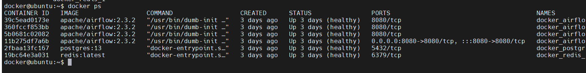

# airflow-dynamic-dag-generator

Dynamic DAG generator allows you to create DAG's dynamically on Airflow using Python's templating library Jinja2.


## Pre-requisites:
Below are the pre-requisites for using this application:
 
a. **Airflow instance** - An airflow instance must be up and running.Use the installation steps mentioned below if not installed.

To install airflow using docker on any server use the below steps:
1. Run the below curl command to get the docker-compose file for airflow.

```commandline
curl -LfO 'https://airflow.apache.org/docs/apache-airflow/2.3.2/docker-compose.yaml'
```
2. Start the airflow instance by running the below command:

```commandline
docker-compose up -d
```
3. Once the containers are up and running you will see the below output.The airflow UI will be 
   available at http://loaclhost:8080



b. **Python** - python and pip must be installed on the machine where the airflow instance is running.Use the below command if not installed.

```commandline
sudo apt-update && sudo apt-get install python3.8 && sudo apt install python3-pip
```

c. **Python Libraries** -Jinja2 library must be installed.Use the below command if not installed.

```commandline
 pip install jinja2
```


## Architectural Flow Diagram:


## Process

The dynamic dag generator does two things 1. create a new dag and 2. delete a new dag. Whenever we want to create a new 
DAG ,we provide the required inputs for creation of DAG and using the Jinja Template the DAG will be created and pushed
into the dag folder mount of the airflow instance which then will be automatically available on the airflow UI scheduled.

## How to use:

#### To create a new DAG:
To create a new DAG using dynamic dag generator run the below commands:

1. Navigate to the project directory
```commandline
cd airflow-dynamic-dag-generator/
```

2. Execute the below python command
```commandline
python3 src/dynamic_dag_generator.py --action create --dag-name generated_dag --dag-id 220608 --schedule-interval @hourly --catchup False --dag-path /home/docker/dags
```
NOTE: Below are the inputs for creating the DAG

Required inputs:
1. --action   - either create/delete.In this case create.
2. --dag-name - Name to be given to the dag file.
3. --dag-id   - a unique id for the dag which will be appended to the dag_name.(Ex: --dag-name sample --dag-id 1 will create a file sample_1.py)
4. --dag-path - path of the airflow dag mount path
5. --schedule-interval -cron pattern of when the job should be scheduled.

Optional input:
6. --catchup - False by default,can be changed to true if needed

#### To delete a  DAG:

1. Execute the below python command to delete a DAG
```commandline
python3 src/dynamic_dag_generator.py --action delete --dag-name generated_dag --dag-id 220608 --dag-path /home/docker/dags
```
NOTE: Below are the inputs for deleting the DAG

Required inputs:
1. --action   - either create/delete.In this case delete.
2. --dag-name - Name to be given to the dag file.
3. --dag-id   - a unique id for the dag which will be appended to the dag_name.
4. --dag-path - path of the airflow dag mount path

